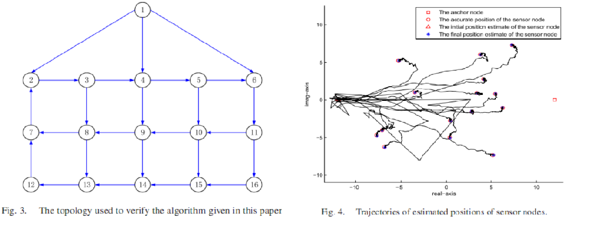

### Distributed Network Localization With Noisy Measurement and Communication Information
The matlab code for the simulation in [Distributed Network Localization: Accurate
Estimation With Noisy Measurement and Communication Information](https://ieeexplore.ieee.org/document/8477181)

1. ``comm_only (comm_only_ave)`` is the code where only communication noises are considered (with 20 samples average) ; 仅考虑通信噪声(20次样本平均)
2. ``measurement_only`` is the code where only measurement noises are considered; 仅考虑测量噪声
3. ``loc_main (loc_main_ave)`` is the main localization code (with some samples average); 主程序
4. ``main_comp_lee`` is the code that compares the algorithm in Lee; 与Lee的算法比较
5. ``main_comp_lin`` is the code that compares the algorithm in Lee; 与Lin的算法比较
6. `` sensor_init`` is the initialization code; 初始化程序

#### simulation
Par of simulation results are shown below.

